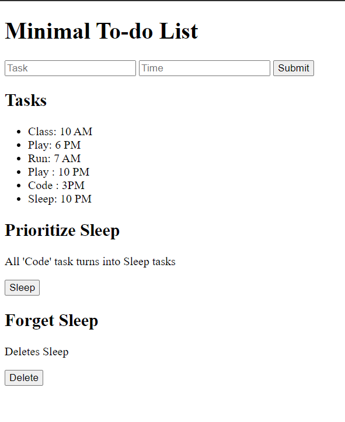

# todo-list
a basic crud app made using Node.js, Express and MongoDB

-can create a new task and add it to the database.

-read and update tasks from the database.

-delete tasks from the database

